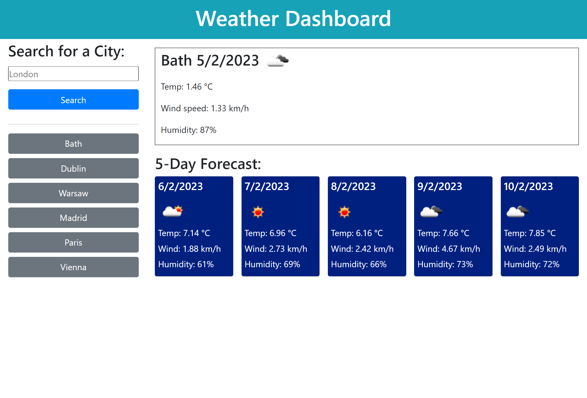

# Weather-Forecaster

# Description
The task for this assignment requires to create an app that allows users to see the weather forecast for cities of their choosing.

The main purpose is to create a weather dashboard with form inputs.
When a user searches for a city they are presented with current and future conditions for that city and that city is added to the search history.

When a user views the current weather conditions for that city they are presented with:
- The city name
- The date
- An icon representation of weather conditions
- The temperature
- The humidity
- The wind speed

When a user views future weather conditions for that city they are presented with a 5-day forecast that displays:
- The date
- An icon representation of weather conditions
- The temperature
- The humidity

When a user clicks on a city in the search history they are again presented with current and future conditions for that city.

# Screenshot

# Links
<ul>
  <li>GitHub Repository: https://github.com/valimanea/Weather-Forecaster/ </li>
  <li>Deployed application: https://valimanea.github.io/Weather-Forecaster/ </li>
</ul>

